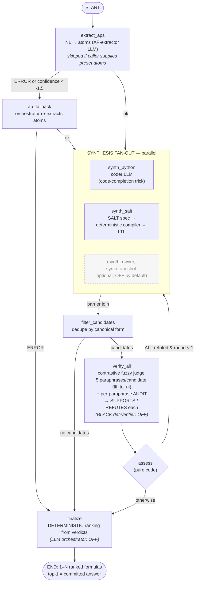

# Pendulum — End-to-End Workflow (step by step)

How a natural-language requirement becomes a ranked Past-LTL / LTL formula. Pendulum is
a **fixed workflow**: the control flow lives in code (a LangGraph `StateGraph`), and LLMs
only perform the narrow sub-tasks they are good at. This document describes the graph,
what runs **concurrently** vs **sequentially**, and every agent's and tool's
input → output → logic.

Entry point: `pendulum.pipeline.translate(nl, config=None, run_id=None, preset_aps=None)
-> FinalOutput`. It builds `PendulumDeps` (LLM router, MCP client, RAG stores, embedder),
compiles the graph via `build_graph(deps)`, runs `graph.ainvoke(initial_state)`, and
returns the ranked result. Every node is wrapped by `node_guard(stage, timeout, logger)` —
a per-node `asyncio.wait_for` timeout + catch-all — so any node that crashes or times out
appends an error to the state and the run still finishes with an honest result.

---

## 1. Topology

Rendered flowchart of the **default** configuration (synthesis = python + SALT; contrastive
per-paraphrase audit judge; deterministic finalize; one feedback loop — dwyer, one-shot, the
BLACK deterministic verifier, and the LLM orchestrator are all OFF by default):



The same graph in text form (with the optional/legacy branches also shown):

```
START
  │  (sequential)
  ▼
① extract_aps ──(ok)──────────────────────────────────────────┐
  │   └─(ERROR or LNLL < threshold)→ ①b ap_fallback ───────────┤
  │                                       └─(ERROR)────→ ⑥ finalize
  ▼   ═══════════ FAN-OUT: parallel synthesis branches ═══════════
② synth_python  ║  synth_salt  ║  [synth_dwyer]      ← CONCURRENT (asyncio branches)
  ▼   ═══════════ BARRIER: wait for all synth branches ══════════
③ filter_candidates                                  ← sequential (1 LLM call)
  │   ├─(no candidates)──────────────────────→ ⑥ finalize
  │   ├─(all already verified)───────────────→ ⑤ assess
  ▼
④ verification
   • contrastive mode (default): ④a verify_all       ← 1 node, 1 judge call
   • legacy mode: Send-per-candidate → ④b verify_candidate  ← CONCURRENT (1 Send/candidate)
  ▼
⑤ assess  (pure code)                                ← sequential
  │   └─(every candidate REFUTED and feedback_round < max)→ back to ②  (feedback loop, ≤1)
  ▼
⑥ finalize                                           ← sequential (1 LLM agent, or deterministic)
  ▼
END  →  FinalOutput{status, formulas:[RankedFormula], ap_mapping, run_id}
```

**Default configuration** (`dwyer` off, `deterministic verifier` off, `contrastive judge`
on) makes the live path:

```
extract_aps → { synth_python ║ synth_salt } → filter_candidates
            → verify_all (one contrastive judge) → assess → finalize
```

### Concurrent vs sequential

| Stage | Concurrency |
|---|---|
| `extract_aps` / `ap_fallback` | **Sequential** (one node each) |
| **synthesis (`synth_python`, `synth_salt`, `synth_dwyer`, `synth_oneshot`)** | **Concurrent** — separate LangGraph branches run in parallel; a **barrier** join reconvenes at `filter_candidates`. Each branch internally runs a **sequential** retry loop. (`synth_dwyer`, `synth_oneshot` are optional, off by default.) |
| `filter_candidates` | Sequential (one LLM call + optional lattice) |
| `verify_all` (contrastive, default) | Sequential node, **one** judge call — but the code-side evidence it gathers (paraphrases, violating traces, lattice) is collected **concurrently** with `asyncio.gather` |
| `verify_candidate` (legacy) | **Concurrent** — one `Send` per filtered candidate; inside each, the fuzzy and deterministic verifiers run **concurrently** (`asyncio.gather`) |
| `assess` | Sequential (pure code, no LLM) |
| `finalize` | Sequential (one PydanticAI agent call, or deterministic ranking) |

### Shared state (`PendulumState`)

One object threads through the graph. Channels written by parallel branches carry reducers:

| Channel | Reducer | Meaning |
|---|---|---|
| `candidates` | `merge_candidates` | concat + dedupe by `canonical`; keep the better-confidence copy, preserve the incumbent id so verdicts aren't orphaned across feedback rounds |
| `verifications`, `errors`, `timings` | `operator.add` (append-only) | accumulate across parallel branches and feedback rounds |
| `ap_result`, `filtered`, `final`, `feedback_*`, `assess_decision` | last-write | single-writer keys |

---

## 2. Data types (the I/O currency)

- **`APMapping`** `{ap: str, nl_fragment: str, polarity: "event"|"state"|None}`
- **`APExtractionResult`** `{status: OK|ERROR, message, ap_nl_mapping_list: [APMapping], confidence: float|None (LNLL)}`
- **`Candidate`** `{id: "<source_agent>-<n>", formula: str, canonical: str (dedupe key), source_agent, confidence: float|None}` — every candidate is already `parse_and_canonicalize`-validated
- **`VerificationResult`** `{candidate_id, agent: "fuzzy"|"deterministic", verdict: SUPPORTS|REFUTES|INCONCLUSIVE|ERROR, confidence: float|None, evidence: str}`
- **`RankedFormula`** `{formula, canonical, rank (1=best), score, justification}`
- **`FinalOutput`** `{status, message, formulas: [RankedFormula], ap_mapping, run_id}`
- **`AgentEnvelope[T]`** `{status, message, payload: T, confidence, attempts, elapsed_s}` — the uniform return of the synthesis agents

---

## 3. Agents — input → output → logic

### ① AP extractor  ·  `extract_aps(nl, deps, *, fallback=False, failure_reason="") -> APExtractionResult`
- **In:** the NL sentence.  **Out:** the atom↦phrase mapping + an LNLL confidence.
- **Logic:** one JSON completion (`json_completion_with_retry`) using the maximum-revelation,
  **tense-neutral-atom** prompt, returning `{STATUS, AP_NL_MAPPING_LIST, CONFIDENCE}`.
  Skipped entirely if the caller passed `preset_aps`. If `status==ERROR` or `LNLL <
  ap_confidence_threshold`, the router sends the state to **`ap_fallback`** (same agent,
  ORCH model, failure reason prepended). If the fallback also fails, the run jumps straight
  to `finalize` with an ERROR envelope.

### ② Synthesis (two agents by default — python + salt; up to four with the optional dwyer/one-shot paths — run in parallel) — all `synthesize_X(nl, aps, deps, feedback="", round_=0) -> AgentEnvelope[list[Candidate]]`
Each produces candidates and validates **every** one through `parse_and_canonicalize`
(the parser gate), with a bounded retry (`SYNTH_PARSE_MAX_RETRIES`) where parse errors are
fed back to the model. On a feedback round, `feedback`/`round_` carry the prior failure
evidence.

- **`synthesize_python`** — the *code-completion trick*: a coding model completes
  `formulaToFind = <constructor expression>` lines against a dataclass AST; the scaffold
  extracts the assignment lines, runs a **safe whitelist AST evaluator** (rejects
  `__import__`, attribute access, etc.), passes the parser gate, and emits a
  grammar-constrained confidence. `PYTHON_AGENT_MODE=mcp` swaps the middle for the parent
  repo's `nl_to_ltl_via_python` MCP tool.
- **`synthesize_salt`** — retrieve SALT-manual excerpts from the RAG index → the LLM authors
  a **SALT spec** → compile it with `nl_to_ltl_via_salt` (Docker) → on a compiler error,
  feed the error text back for a bounded fix loop (`SALT_FIX_MAX_ATTEMPTS`) → parser gate.
  Reserved-word mangling avoids atom/keyword clashes.
- **`synthesize_dwyer`** *(opt-in; off by default)* — embed the NL → RAG top-k over the
  Dwyer pattern catalogue (`data/dwyer_patterns.json`) → the LLM selects a pattern+scope and
  substitutes the provided atoms → instantiate the template → parser gate.

### ③ Filter  ·  `filter_candidates(nl, aps, candidates, deps, verifications=None) -> (kept: list[Candidate], reasoning: str)`
- **In:** all merged/deduped candidates (plus prior verdicts on feedback rounds).
  **Out:** the subset that advances to (expensive) verification.
- **Logic:** one JSON completion picking which candidates to keep; **degrades to a
  deterministic keep-list** (`_heuristic_keep`) rather than ever failing the run. Optional
  `PENDULUM_ORCH_COMPARE_FILTER` first merges equivalent candidates via a
  `compare_candidates` lattice rendered into the prompt.

### ④ Verification

- **Contrastive (default)  ·  `verify_row_contrastive(nl, aps, candidates, deps) -> list[VerificationResult]`**
  - The code assembles evidence for the **whole filtered row**: per-candidate
    `ltl_to_nl` paraphrases, per-candidate `gen_violating_trace` "forbidden example", and a
    `compare_candidates` entailment lattice rendered with candidate ids. Evidence is gathered
    concurrently. Then **one** falsification-framed judge completion returns a verdict per
    candidate (schema-constrained).
- **Fuzzy, per-candidate (legacy)  ·  `verify_fuzzy(nl, aps, candidate, deps) -> VerificationResult`**
  - `ltl_to_nl` (5 paraphrases) + one judge completion with an LNLL confidence.
- **Deterministic (opt-in)  ·  `verify_deterministic(nl, aps, candidate, others, deps) -> VerificationResult`**
  - A genuine PydanticAI agent with **free tool choice restricted to the 8 BLACK tools**,
    `UsageLimits(request_limit=MAX_STEPS)`, structured `DeterministicVerdict` output.
    Confidence is `None` by design (no logprobs); its value is solver-backed evidence.

### ⑤ Assess (pure code, no LLM)
- Reads `filtered` + `verifications`. If **every** filtered candidate lacks a `SUPPORTS`
  verdict **and** `feedback_round < feedback_max_rounds`, it writes `assess_decision="loop"`
  plus a `feedback_evidence` digest and routes **back to synthesis** (bounded to
  `PENDULUM_FEEDBACK_MAX_ROUNDS`, default 1). Otherwise `assess_decision="finalize"`.

### ⑥ Finalize  ·  `finalize(nl, aps, candidates, verifications, deps, *, lattice_text="") -> FinalOutput`
- **In:** the filtered candidates + all their verdicts.  **Out:** 1–5 ranked formulas.
- **Logic:** by default a PydanticAI agent (the pipeline's "powerful" model) with the BLACK
  toolset produces the ranking; every output formula is **re-validated through the parser**.
  On agent crash/timeout it **degrades to `_deterministic_ranking`** (SUPPORTS − REFUTES,
  confidence tie-break). `PENDULUM_ORCH_DETERMINISTIC=true` skips the LLM and uses that
  deterministic ranking directly — which the end-to-end experiment found *more accurate and
  more robust* than the LLM finalize (171 vs 140 top-1; 0 vs 42 failures). `_finish` then
  optionally appends all survivors, expands scope-variants, caps to `max_output_formulas`,
  and sequentially re-ranks.

**Hard verification gate:** the agent may not emit a final answer until `ltl_to_nl` has been
called on the candidate — no formula ships un-paraphrased.

---

## 4. The 14 MCP tools (`pltl-mcp`) — input → output

**Symbolic (parser / BLACK SAT / Docker), deterministic:**

| Tool | In → Out |
|---|---|
| `parse_and_canonicalize` | `formula` → `{canonical, aps, nnf, simplified, temporal_class}` — the parser gate |
| `check_equivalence` | `f1, f2` → `{equivalent: bool}` |
| `check_entailment` | `f1, f2` → `{entails: bool}` (does f1 ⊨ f2) |
| `check_consistency` | `formula(s)` → `{consistent: bool}` |
| `compare_candidates` | `candidates[]` → pairwise equivalence/entailment lattice |
| `gen_satisfying_trace` | `formula` → a satisfying ω-trace (model) |
| `gen_violating_trace` | `formula` → a counterexample trace |
| `distinguishing_trace` | `f1, f2` → a trace where the two disagree |
| `check_trace_satisfaction` | `formula, trace` → `{satisfies: bool}` |
| `nl_to_ltl_via_salt` | `salt_spec` → LTL (Docker `salt-compiler`) |
| `salt_help` | – → static SALT syntax reference |

**LLM-backed (helper model, cached only at temperature 0):**

| Tool | In → Out |
|---|---|
| `extract_ap_mapping` | `text` → atomic-proposition mapping |
| `nl_to_ltl_via_python` | `nl` → LTL (helper-LLM code trick) |
| `ltl_to_nl` | `formula` → **5 NL paraphrases** (the verification-gate tool) |

Tool I/O convention: input is a JSON object with at least `formula: string`; parser failures
surface as MCP `invalid_params` with the OCaml message verbatim; formulas are pretty-printed
with the `Display` impl so one tool's output feeds the next. Results are LRU-cached
(`MCP_CACHE_CAPACITY`, default 1024).

---

## 5. Reliability properties

- **No node can crash the run** — `node_guard` converts timeouts/exceptions into recorded
  errors; a run with zero candidates short-circuits to `FinalOutput(status="ERROR")`.
- **Bounded everywhere** — synthesis parse-retries, SALT fix attempts, deterministic-verifier
  steps, and the feedback loop are all capped by config.
- **Backend degradation** — the LLM router health-caches backends and falls back
  (llama-server → Ollama); when llama-server is down, grammar/logprobs degrade to `null`
  confidences rather than failing.
- **Faithful selection** — every finalize path (LLM or deterministic) re-validates formulas
  through the parser, so the returned answer is always well-formed.
